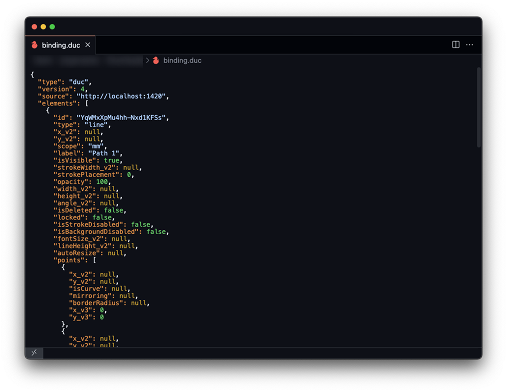

# Duc - VS Code Extension

A Visual Studio Code extension that allows you to view Duc binary files (Flatbuffers format) as pretty-formatted JSON.

## Features

- Automatically converts `.duc` binary files to JSON using FlatBuffers
- Displays the resulting JSON with syntax highlighting
- Works with the [Duc file format](https://github.com/ducflair/duc)
- **Automatically downloads** the FlatBuffers compiler (flatc) if not already installed

## Requirements

No manual installation required! The extension will automatically download the appropriate FlatBuffers compiler (flatc) for your platform.

If you already have flatc installed, the extension will use that version. Otherwise, it will download and set up the compiler for you.

## Usage

1. Install the extension
2. Open a .duc file in VS Code
3. The file will automatically open in the Duc Viewer

Alternatively, you can:
1. Right-click on a .duc file in the Explorer
2. Select "Open with Duc Viewer"

## How it works

The extension:
1. Reads the binary .duc file
2. Uses an embedded Duc schema file (downloaded during build time)
3. Automatically downloads the FlatBuffers compiler (flatc) if needed
4. Uses the FlatBuffers compiler to convert the binary to JSON
5. Displays the resulting JSON in a custom editor with syntax highlighting

## Troubleshooting

### Common Issues

1. **First-time loading is slow**
   - The initial load might take a few seconds as the extension downloads the FlatBuffers compiler (only if not already installed)

2. **Conversion fails**
   - Check that you have a valid .duc file
   - Ensure you have internet access if the FlatBuffers compiler needs to be downloaded
   - Try running the "Check if FlatBuffers compiler is installed" command from the Command Palette

## Development

### Extension Development

- Open this project in VS Code
- `npm install`
- `npm run watch` or `npm run compile`
- Press `F5` to start debugging

### CI/CD

This extension uses GitHub Actions for continuous integration and delivery:

- Automated versioning using semantic-release
- Automated packaging and publishing to VS Code Marketplace
- Automated GitHub releases with change notes

To contribute, please follow the [Conventional Commits](https://www.conventionalcommits.org/) specification for your commit messages to ensure proper versioning.

## License

MIT