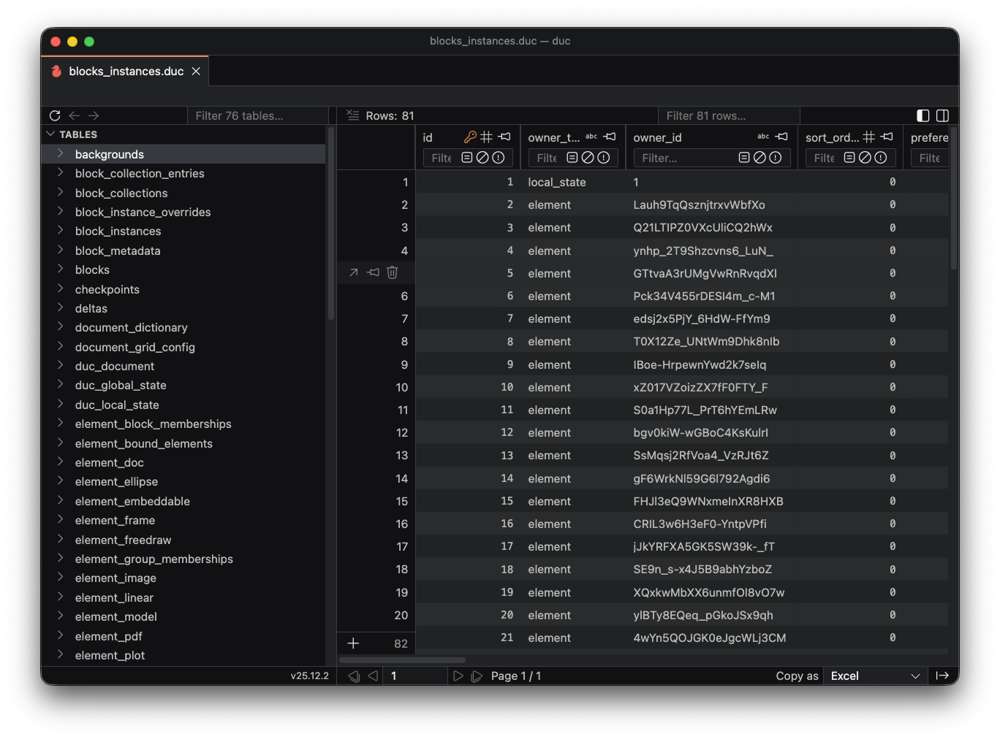

# Duc - VS Code Extension

A Visual Studio Code extension that opens `.duc` files as SQLite databases.

## Features

- Automatically associates `*.duc` files with the SQLite Viewer editor
- Uses [SQLite Viewer](https://marketplace.visualstudio.com/items?itemName=qwtel.sqlite-viewer) to inspect `.duc` contents
- Keeps your workflow lightweight (no custom conversion pipeline)

## Requirements

This extension depends on the SQLite Viewer extension and declares it as an extension dependency. VS Code will install it automatically when needed.

## Usage

1. Install the extension
2. Open a .duc file in VS Code
3. The file will automatically open with SQLite Viewer

## Troubleshooting

### Common Issues

1. **A `.duc` file does not open in SQLite Viewer**
   - Use **Reopen Editor With...** and pick SQLite Viewer
   - Verify SQLite Viewer extension is installed and enabled

2. **SQLite Viewer reports invalid database**
   - Confirm the `.duc` file is a valid SQLite database file